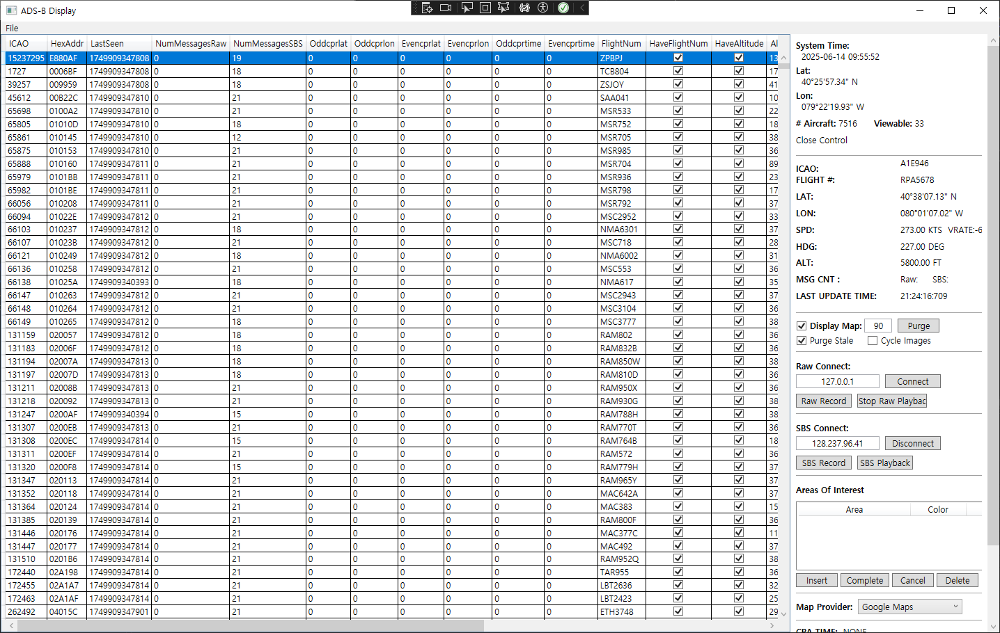
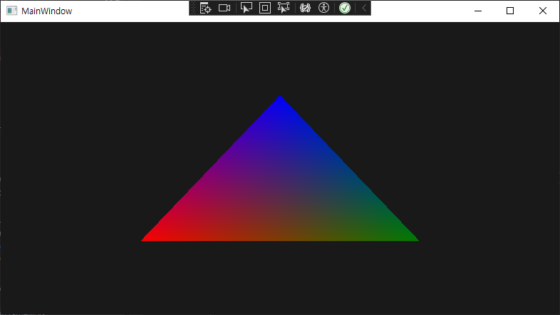
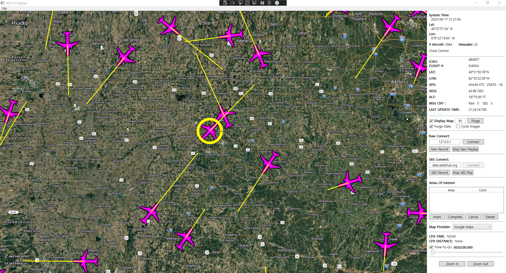

# Experiment 3: Implement a C#-based prototype

## Results and recommendations
Evaluation showed that C#/WPF can successfully reproduce the core features of the existing system with comparable performance.  
The prototype demonstrated stable UI, data handling, and rendering behavior. The approach is feasible for adoption.  

## Objective  
Determine wheC#/WPF can be used to reimplement the main components of the current system (UI, TCP, rendering, etc.)
with performance and usability equal to or better than the existing C++/Embarcadero solution.
The outcome will inform the decision of whether to migrate the full system to C#/WPF.

## Status
[Concluded]

## Expected outcomes
- A working C#/WPF prototype
- Performance and functional comparison vs. current implementation
- Internal team presentation or documentation
- List of known issues and resolution strategies

## Resources required
- Visual Studio 2022
- .NET Framework 4.7.2
- WPF Framework
- OpenGL binding for .NET
- Current source code for reference
- ChatGPT (for development assistance)
- 5 person-days
- Windows PC

## Experiment description
1. Study existing C++/Embarcadero implementation
2. Build and test components:
   - UI using WPF
   - TCP client for data streaming
   - Parser for TCP messages
   
   - Test OpenGL binding for .NET
   
   - OpenGL-based aircraft and map time rendering
   
3. Measure performance of prototype
4. Compare results with existing system
5. Share results and conclusions

## Duration
- Start date: 2025-06-09
- Step 1 (UI + TCP): 2025-06-11
- Step 2 (Rendering): 2025-06-13
- Step 3 (Integration, Map, Final Tests): 2025-06-17
- Deadline: 2025-06-17

## Links and references
- [.NET WPF documentation](https://learn.microsoft.com/en-us/dotnet/desktop/wpf/)
- [OpenTK project](https://opentk.net/)
- Reference C++ codebase provided by SolveIt
