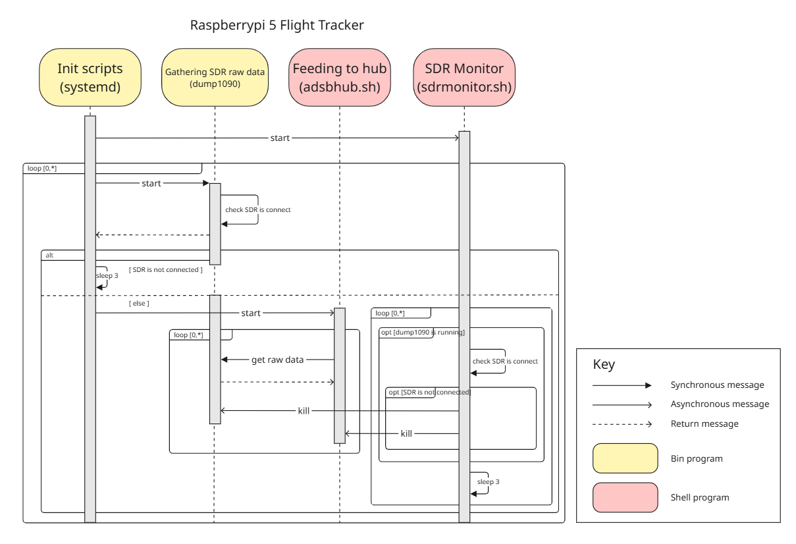

# Experiment 5: SDR connection recovery experiment

## Results and recommendations
The experiment has been concluded successfully.

- It was confirmed that when the SDR are physically connected and functioning properly, the `dump1090` program runs without error and successfully feeds data to ADSBHub.
- A `systemd` service unit was created to automatically start both `dump1090` and the ADSBHub feeding script at system boot.
- It was verified that `dump1090` automatically restarts when it is terminated abnormally (e.g., via kill signal), using `Restart=always` in the service unit configuration.
- A monitoring script (`sdrmonitor`) was developed to detect whether the SDR is physically connected and functioning.
- When a fault is detected, the script stops both `dump1090` and the ADSBHub feeding script.
- While the hardware is disconnected, `systemd` continues attempting to restart `dump1090`, but it fails as expected.
- Once the hardware connection is restored, the system automatically recovers: `dump1090` and the feeding script restart and resume operation successfully.
- To validate recovery robustness, the SDR antenna was manually disconnected and reconnected **50 times**, and in all 50 cases the system successfully detected the change and fully recovered.
- Additionally, the Raspberry Pi was rebooted **50 times** to test system initialization. Only **one** failure occurred, and the root cause was determined to be a general Raspbian OS boot hang, **unrelated to the SDR or our recovery tactic**.
- These results confirm the reliability and resilience of the proposed tactic for SDR failure detection and recovery.
- The interaction and timing among `systemd`, `dump1090`, the ADSBHub feeding script, and the `sdrmonitor` script is illustrated in the following sequence diagram:
  

- The `systemd` unit files and supporting scripts are under active development at:
  [https://github.com/dpmin7/flight-tracker](https://github.com/dpmin7/flight-tracker)

## Objective
The objective of this experiment is to determine whether it is possible to automatically detect a physical failure (e.g., disconnection or malfunction) in the SDR or antenna and recover from it by:
- stopping the `dump1090` program when a failure is detected, and
- restarting `dump1090` and resuming feeding to ADSBHub once the hardware connection is restored.

This will help increase the robustness and availability of the ADS-B data feeder system running on Raspberry Pi 5.

## Status
Concluded

## Expected outcomes
- Automatic shutdown of `dump1090` when SDR or antenna is physically disconnected or fails ✅ Achieved
- Automatic recovery and restart of `dump1090` and resumption of data feeding to ADSBHub when the issue is resolved ✅ Achieved
- Optional: a script or monitoring service prototype implementing the above behavior ✅ Implemented

## Resources required
- Raspberry Pi 5
- SDR (Software Defined Radio) USB device
- ADS-B antenna
- `dump1090` program
- ADSBHub feeding script
- 1 person-day, at a rate of 1 hour/day
- Internet connection

## Experiment description
The experiment proceeded as follows:

1. Set up `dump1090` and the ADSBHub feeding script on Raspberry Pi 5 with SDR and antenna connected — ✅ Confirmed.
2. Created a `systemd` service unit that starts `dump1090` and the ADSBHub script at system boot — ✅ Completed.
3. Verified that `dump1090` restarts on abnormal termination (e.g., kill signal) — ✅ Verified.
4. Developed `sdrmonitor` script to detect SDR/antenna hardware connection status — ✅ Implemented.
5. On hardware failure, `sdrmonitor` stops both `dump1090` and the feeding script — ✅ Confirmed.
6. Verified that `systemd` continues to attempt restarting `dump1090`, but fails due to missing hardware — ✅ Observed.
7. Upon reconnecting the SDR, verified that `systemd` successfully restarts `dump1090` and feeding resumes — ✅ Confirmed.
8. Repeated hardware disconnection and reconnection 50 times — ✅ All cases successfully recovered.
9. Rebooted Raspberry Pi 50 times — ✅ Only 1 failure due to unrelated OS boot issue.
10. Documented the behavior with a sequence diagram (see Figure 1).

## Duration
Deadline: 2025-06-17 ✅ Met

## Links and references
- https://github.com/antirez/dump1090
- https://www.adsbhub.org/howtofeed.php
- https://github.com/dpmin7/flight-tracker
